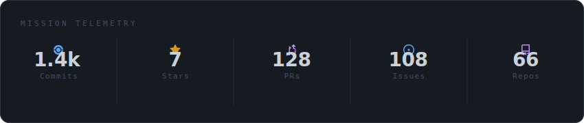

<!-- Galaxy Profile README -->

  

 

  

 

  

 

  

 

<strong>More about me</strong>

 

### 🧠 About Me

Building robust digital platforms with a focus on scalable architecture, automated testing, and seamless CI/CD pipelines.

Currently, I work at [INOVIA](https://inoviacorp.ai/), building robust digital platforms. My focus has shifted from just "writing code" to **engineering complete solutions** prioritizing scalable architecture, automated testing strategies (E2E/Unit), and seamless CI/CD pipelines.

I have a background in Computer Science from **IFSP** and I am currently pursuing a degree in Analysis and Systems Development at **FATEC Campinas**.

**Currently at** INOVIA — Campinas, Brazil

 

### 📫 Connect with me

  
  
  
  

